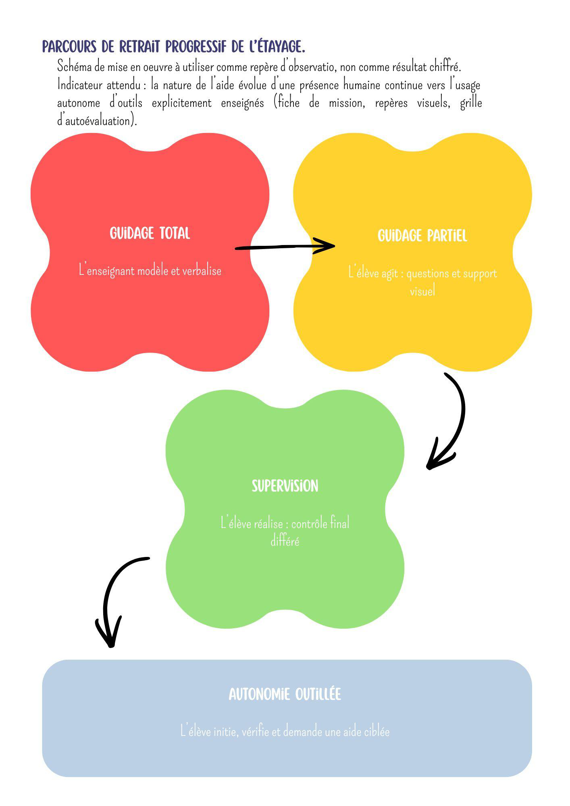
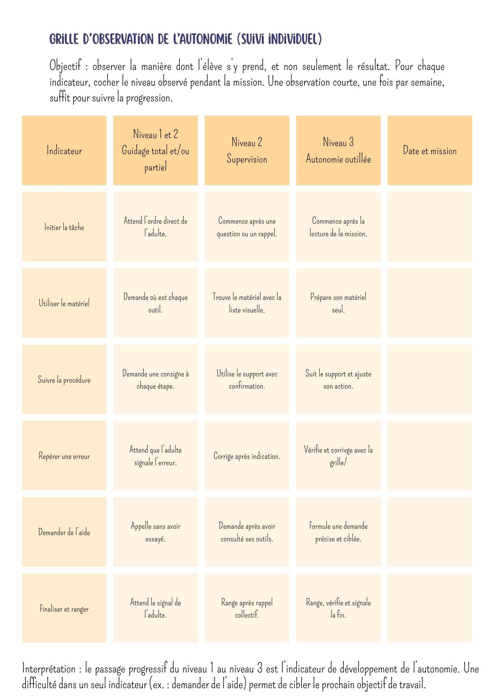
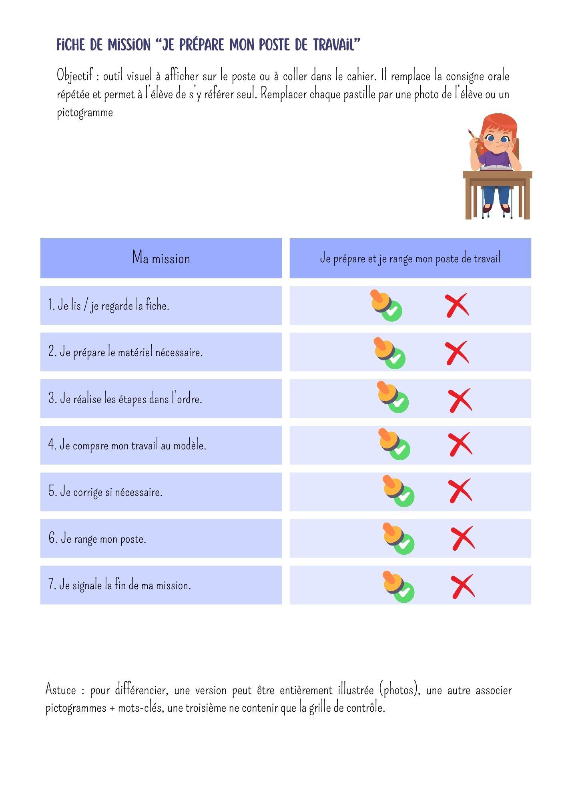
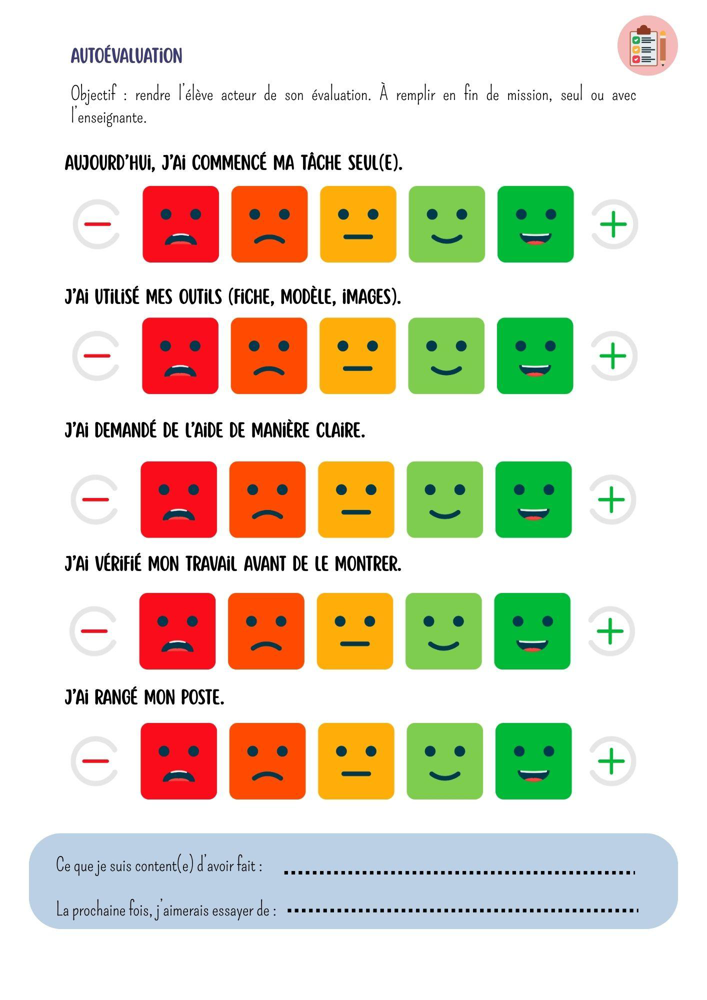
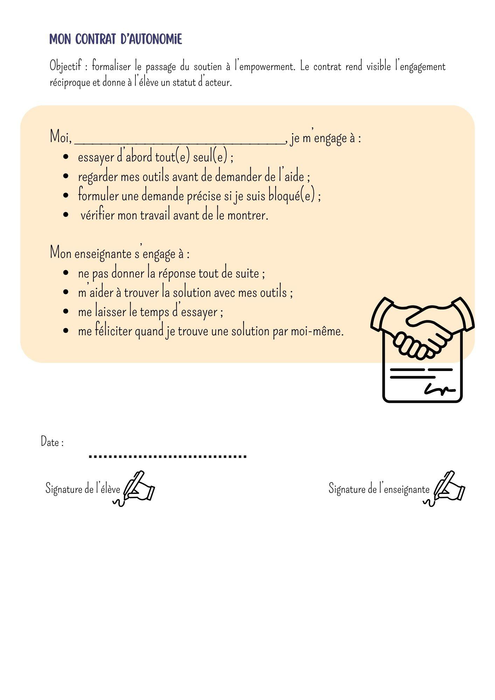
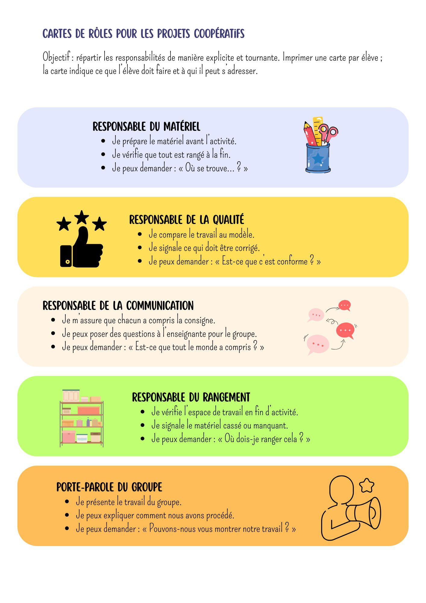
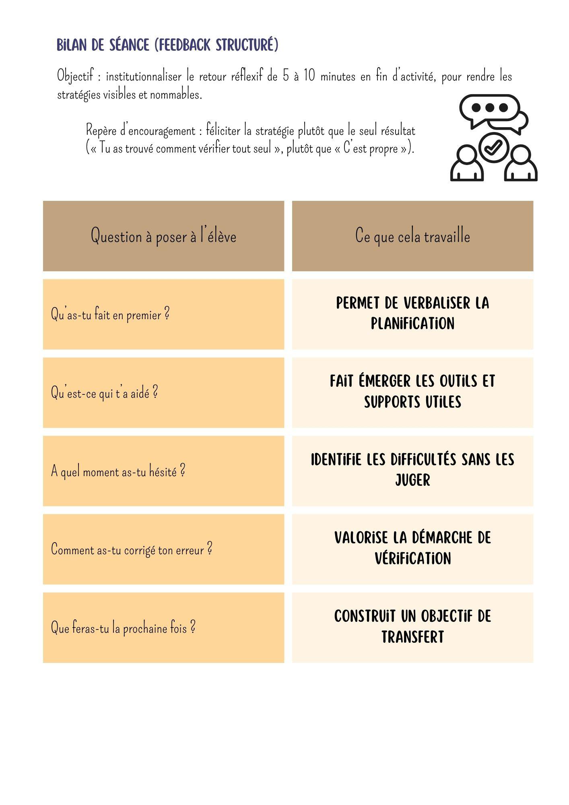
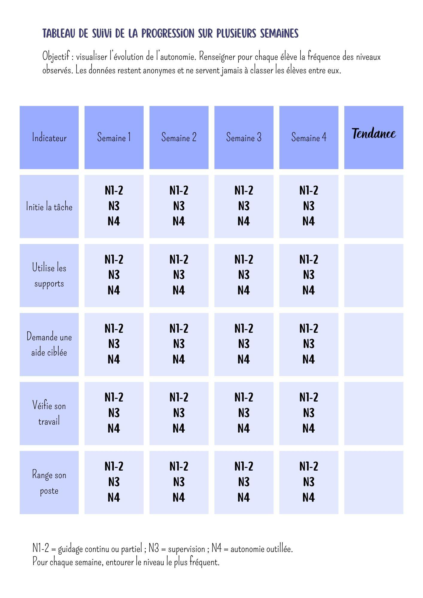

# VII. Annexes

> **Source** : PDF envoyé au réviseur — version avec corrections (42 pages, 07-08/08/2026).
> Les annexes sont des supports pédagogiques créés par Émilie (schémas, grilles, fiches).

---

## A. Annexe 1 – Schéma de retrait progressif de l'étayage

## B. Annexe 2 – Grille d'observation de l'autonomie (suivi individuel)

## C. Annexe 3 – Fiche de mission « Je prépare mon poste de travail »

## D. Annexe 4 – Autoévaluation

## E. Annexe 5 – Contrat d'autonomie (élève / enseignante)

## F. Annexe 6 – Cartes de rôles pour les projets coopératifs

## G. Annexe 7 – Fiche « Avant de demander de l'aide, j'ai déjà… »

## H. Annexe 8 – Bilan de séance (feedback structuré)

## I. Annexe 9 – Tableau de suivi de la progression sur plusieurs semaines

